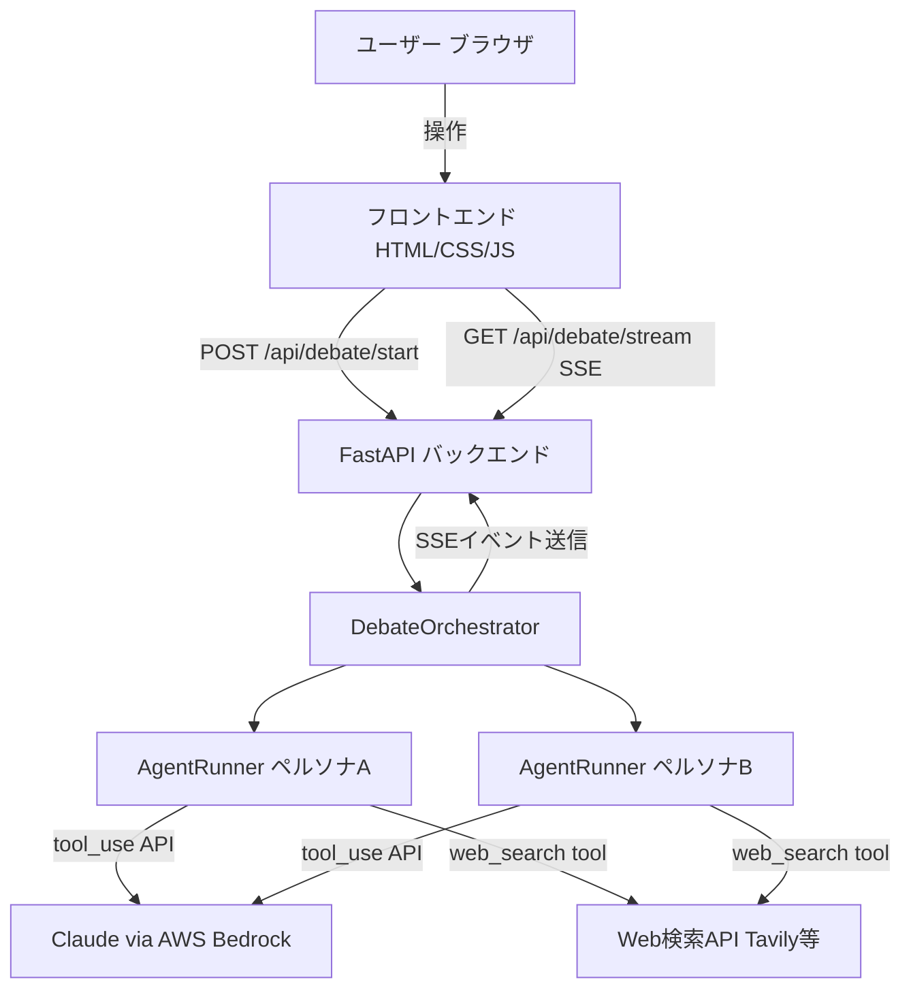
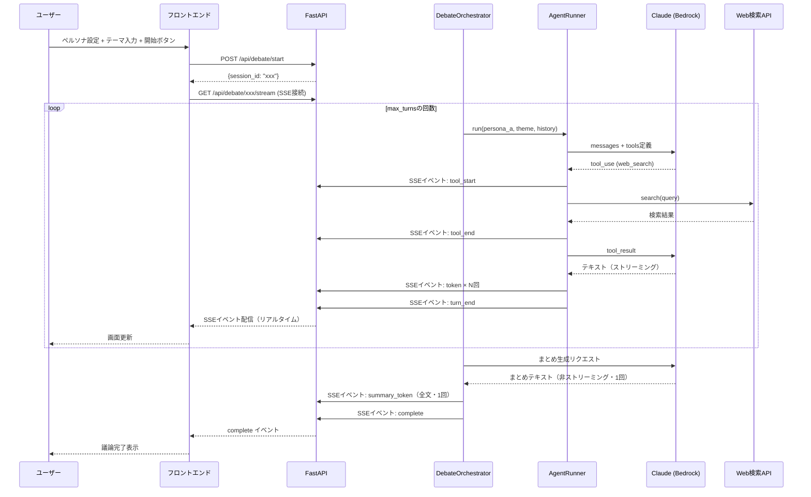
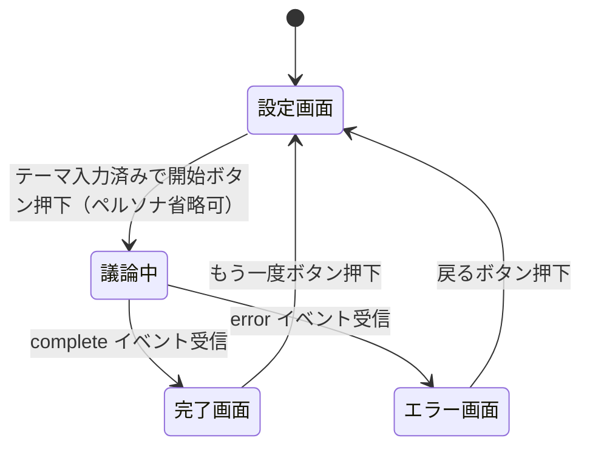

# 機能設計書 (Functional Design Document)

## システム構成図



## 技術スタック

| 分類 | 技術 | 選定理由 |
|------|------|----------|
| 言語 | Python 3.12 | 型安全・async対応・AIライブラリの充実 |
| Webフレームワーク | FastAPI | 非同期処理・SSE対応・型定義との親和性 |
| LLM | Claude claude-haiku-4-5 via AWS Bedrock | tool_use対応・高速・コスト効率良好 |
| LLM SDK | anthropic (AnthropicBedrock) | Bedrock対応・tool_use APIが直感的 |
| Web検索 | Tavily API | LLM向け検索APIとして設計・精度良好 |
| フロントエンド | HTML / CSS / Vanilla JS | MVPに必要最小限・SSE対応が容易 |
| リアルタイム通信 | Server-Sent Events（SSE） | 単方向ストリームに最適・実装シンプル |

---

## データモデル定義

### エンティティ: Persona（ペルソナ）

```python
from dataclasses import dataclass

@dataclass
class Persona:
    name: str        # ペルソナの名前（例: "楽観的なコンサルタント"）
    description: str # 立場・性格の説明（例: "AI投資に積極的な経営者。根拠を示して主張する"）
```

---

### エンティティ: DebateConfig（議論設定）

```python
@dataclass
class DebateConfig:
    persona_a: Persona  # ペルソナA
    persona_b: Persona  # ペルソナB
    theme: str          # 議論テーマ（例: "AIベンチャーへの投資はすべきか"）
    max_turns: int = 2  # ターン数（1ターン = A発言 + B発言）。APIから1〜6で指定可能
```

---

### エンティティ: ToolCall（ツール使用ログ）

```python
from typing import Literal

ToolName = Literal["web_search"]

@dataclass
class ToolCall:
    tool_name: ToolName       # 使用したツール名
    input: dict[str, object]  # ツールへの入力（例: {"query": "AI投資 ROI 2025"}）
    output: str               # ツールの出力結果
```

---

### エンティティ: DebateTurn（1発言）

```python
from typing import Literal

Speaker = Literal["persona_a", "persona_b"]

@dataclass
class DebateTurn:
    speaker: Speaker                              # 発言者
    content: str                                  # 発言内容
    tool_calls: list[ToolCall] = field(default_factory=list)  # この発言で使用したツール
```

---

### エンティティ: DebateSession（議論セッション全体）

```python
from enum import StrEnum

class DebateStatus(StrEnum):
    RUNNING = "running"
    COMPLETED = "completed"
    ERROR = "error"

@dataclass
class DebateSession:
    session_id: str                              # UUID
    config: DebateConfig                         # 議論設定
    turns: list[DebateTurn] = field(default_factory=list)  # 発言履歴
    summary: str | None = None                   # 最終まとめ（完了時に設定）
    status: DebateStatus = DebateStatus.RUNNING  # 現在の状態
```

---

## コンポーネント設計

### 1. APIレイヤー（FastAPI Router）

**責務**:
- HTTPリクエストの受付とレスポンス返却
- 入力値のバリデーション
- SSEストリームの管理

**インターフェース**:
```python
# POST /api/debate/start
# 議論セッションを開始し、session_idを返す
async def start_debate(request: DebateStartRequest) -> DebateStartResponse: ...

# GET /api/debate/{session_id}/stream
# SSEでリアルタイムに議論イベントを配信する
async def stream_debate(session_id: str) -> EventSourceResponse: ...
```

**依存関係**:
- `DebateService`

---

### 2. DebateService（セッションライフサイクル管理）

**責務**:
- セッション作成とバックグラウンド議論開始の一元管理
- APIレイヤーがインフラ層（session_store）に直接依存しないよう仲介する

**インターフェース**:
```python
class DebateService:
    def __init__(self, orchestrator: DebateOrchestrator | None = None) -> None: ...
    def create_and_start(self, config: DebateConfig) -> tuple[str, DebateEventQueue]: ...
    def get_stream_queue(self, session_id: str) -> DebateEventQueue: ...
    def get_session_for_export(self, session_id: str) -> DebateSession: ...
    def release_queue(self, session_id: str) -> None: ...
```

**依存関係**:
- `DebateOrchestrator`
- `session_store`（インフラレイヤー）

---

### 3. DebateOrchestrator（議論制御）

**責務**:
- ペルソナAとBの発言順序を管理する
- 各ターンで`AgentRunner`を呼び出す
- 全ターン終了後にまとめを生成する
- 各ステップのイベントをSSEキューに送信する

**インターフェース**:
```python
class DebateOrchestrator:
    async def run(
        self,
        config: DebateConfig,
        event_queue: asyncio.Queue,
        session: DebateSession,  # 呼び出し元が先に作成したセッション（インプレース更新）
    ) -> None: ...  # セッションはインプレースで更新（status/turns/summaryを変更）
```

**処理フロー**:
1. ペルソナAが最初に発言（`AgentRunner.run(persona_a, theme, history=[])`）
2. ペルソナBが反論（`AgentRunner.run(persona_b, theme, history=[turn_a])`）
3. 1〜2を`max_turns`回繰り返す
4. まとめ生成（別のLLM呼び出しで全ターンを要約）
5. 完了イベントをキューに送信

---

### 4. AgentRunner（1エージェントの実行）

**責務**:
- 1ペルソナの1ターン発言を生成する
- tool_use APIを使ってツールを自律的に呼び出す
- 発言生成とツール使用のストリーミングイベントを送信する

**インターフェース**:
```python
class AgentRunner:
    async def run(
        self,
        persona: Persona,
        theme: str,
        history: list[DebateTurn],
        event_queue: asyncio.Queue,
        speaker: Speaker,  # "persona_a" or "persona_b"（DebateOrchestratorが指定）
    ) -> DebateTurn: ...
```

**tool_use ループの設計**:
```
1. Claudeにシステムプロンプト + 会話履歴 + ツール定義を送る
2. Claudeがtool_useを返した場合:
   a. ツール名とinputをイベントキューに送信（画面表示用）
   b. 該当ツールを実行（Web検索等）
   c. 結果をtool_resultとしてClaudeに返す
   d. 検索回数が MAX_SEARCHES_PER_TURN（= 2）に達した場合、以降のリクエストでは
      tools=[] としてツールを無効化し、Claudeに発言を強制完了させる
   e. 2に戻る（Claudeが通常テキストを返すまで繰り返す）
3. Claudeが通常テキストを返したら発言完了（token・turn_end イベントを1回送信）
```

**依存関係**:
- `WebSearchTool`
- AWS Bedrock（anthropic SDK）

---

### 5. WebSearchTool（Web検索ツール）

**責務**:
- Claudeからの検索クエリを受け取りWeb検索を実行する
- 検索結果をClaudeが読める形式で返す

**インターフェース**:
```python
class WebSearchTool:
    async def search(self, query: str) -> str: ...
    # 戻り値: 検索結果のテキスト（上位3〜5件のタイトル+スニペット）
```

**ツール定義（Claudeに渡す形式）**:
```python
WEB_SEARCH_TOOL = {
    "name": "web_search",
    "description": "インターネットでリアルタイム情報を検索します。最新のデータや統計、ニュースを根拠として使いたいときに使用してください。",
    "input_schema": {
        "type": "object",
        "properties": {
            "query": {
                "type": "string",
                "description": "検索クエリ（日本語または英語）"
            }
        },
        "required": ["query"]
    }
}
```

---

## SSEイベント設計

議論の進行状況をフロントエンドにリアルタイム配信するイベント定義。

```python
from typing import Literal

EventType = Literal[
    "turn_start",     # 発言開始（どのペルソナか）
    "token",          # テキストトークン（ストリーミング）
    "tool_start",     # ツール使用開始
    "tool_end",       # ツール使用完了
    "turn_end",       # 発言完了
    "summary_start",  # まとめ生成開始
    "summary_token",  # まとめのトークン
    "complete",       # 全議論完了
    "error",          # エラー発生
]
```

**SSEイベント例（JSON形式）**:
```json
// 発言開始
{"type": "turn_start", "speaker": "persona_a", "name": "楽観コンサル"}

// テキストストリーム
{"type": "token", "speaker": "persona_a", "text": "AIへの投資は"}

// ツール使用開始
{"type": "tool_start", "speaker": "persona_b", "tool": "web_search", "query": "AI投資 ROI 2025"}

// ツール使用完了
{"type": "tool_end", "speaker": "persona_b", "tool": "web_search", "result_summary": "3件の検索結果を取得"}

// 発言完了（発言内容全文を含む）
{"type": "turn_end", "speaker": "persona_a", "content": "AIへの投資は今が最大のチャンスです。"}

// 全完了
{"type": "complete", "session_id": "xxx"}
```

---

## ユースケース図

### 議論開始〜完了のフロー



---

## 画面遷移図



---

## API設計

### POST /api/debate/start

議論セッションを開始する。

**リクエスト**:
```json
{
  "persona_a": {
    "name": "楽観的なコンサルタント",
    "description": "AI投資に積極的。成長機会を重視して主張する。"
  },
  "persona_b": {
    "name": "慎重なリスクアナリスト",
    "description": "リスク管理を重視。データに基づいて反論する。"
  },
  "theme": "AIベンチャーへの投資はすべきか",
  "max_turns": 2
}
```

`max_turns`: 省略可（デフォルト: 2）。範囲: 1〜6。

**レスポンス**:
```json
{
  "session_id": "550e8400-e29b-41d4-a716-446655440000"
}
```

**エラーレスポンス**:
- `422 Unprocessable Entity`: 入力値が不正（テーマが空、`max_turns` が範囲外等）

---

### GET /api/debate/{session_id}/export

議論セッションをMarkdownファイルとしてダウンロードする。

**レスポンス**: `text/markdown; charset=utf-8`（ファイルダウンロード）

```markdown
# 議論: {theme}

## ペルソナ設定

### ペルソナ A: {persona_a.name}
{persona_a.description}

### ペルソナ B: {persona_b.name}
{persona_b.description}

---

## 議論の内容

### {speaker_name}

{content}

---

## まとめ

{summary}
```

**エラーレスポンス**:
- `404 Not Found`: session_idが存在しない

---

### GET /api/debate/{session_id}/stream

SSEでリアルタイムに議論イベントを配信する。

**レスポンス**: `text/event-stream`（SSE形式）

```
data: {"type": "turn_start", "speaker": "persona_a", "name": "楽観的なコンサルタント"}

data: {"type": "token", "speaker": "persona_a", "text": "AIへの投資は今が"}

data: {"type": "complete"}
```

**エラーレスポンス**:
- `404 Not Found`: session_idが存在しない

---

## UI設計

### 設定画面

```
┌────────────────────────────────────────────────────┐
│  🗣️ AI討論 - AI Debate                              │
├────────────────────────────────────────────────────┤
│                                                    │
│  ペルソナ A                                         │
│  名前: [楽観的なコンサルタント________________]       │
│  立場: [AI投資に積極的。成長機会を重視______]         │
│                                                    │
│  ペルソナ B                                         │
│  名前: [慎重なリスクアナリスト________________]       │
│  立場: [リスク管理重視。データで反論_________]         │
│                                                    │
│  議論テーマ                                         │
│  [AIベンチャーへの投資はすべきか______________]       │
│                                                    │
│             [  議論スタート  ]                      │
│                                                    │
└────────────────────────────────────────────────────┘
```

### 議論画面

```
┌────────────────────────────────────────────────────┐
│  AI討論: AIベンチャーへの投資はすべきか               │
├────────────────────────────────────────────────────┤
│                                                    │
│  🔵 楽観的なコンサルタント                           │
│  ┌──────────────────────────────────────────────┐  │
│  │ AIへの投資は今が最大のチャンスです。           │  │
│  │   🔍 Web検索中: "AI投資 ROI 2025"...         │  │
│  │ Gartnerの調査によると、AI投資のROIは...       │  │
│  └──────────────────────────────────────────────┘  │
│                                                    │
│  🔴 慎重なリスクアナリスト                           │
│  ┌──────────────────────────────────────────────┐  │
│  │ ✍️ 考え中...                                  │  │
│  └──────────────────────────────────────────────┘  │
│                                                    │
└────────────────────────────────────────────────────┘
```

### カラーコーディング

| 要素 | 色 | 用途 |
|------|----|------|
| ペルソナA | 青（#3B82F6） | 発言バブル・名前 |
| ペルソナB | 赤（#EF4444） | 発言バブル・名前 |
| ツール使用 | グレー（#6B7280） | tool_start/tool_end表示 |
| まとめ | 黄緑（#10B981） | 最終まとめセクション |

---

## エラーハンドリング

### エラーの分類

| エラー種別 | 処理 | ユーザーへの表示 |
|-----------|------|-----------------|
| 入力バリデーションエラー | 議論開始をブロック | 「テーマを入力してください」（ペルソナは省略可・デフォルト補完） |
| Bedrock API エラー | SSEでerrorイベント送信 | 「AI応答の取得に失敗しました。しばらく後に再試行してください」 |
| Web検索エラー | 検索をスキップして議論継続 | ツール使用ログに「検索失敗」と表示（議論は止めない） |
| SSE接続切断 | バックグラウンドタスクをキャンセル | 再接続時にセッション状態を返す |
| SSEタイムアウト（300秒超過） | errorイベント送信 + SSE接続終了 | 「タイムアウトしました」 |
| セッションNotFound | 404を返す | 「議論セッションが見つかりません。最初からやり直してください」 |

### エラークラス定義

実装箇所: `src/app/models/errors.py`

```python
class DebateError(Exception):
    """議論アプリ基底エラー"""

class ValidationError(DebateError):
    def __init__(self, field: str, message: str) -> None:
        super().__init__(message)
        self.field = field

class LLMError(DebateError):
    """LLM API呼び出し失敗"""

class SearchError(DebateError):
    """Web検索失敗（議論は継続可能）"""

class SessionNotFoundError(DebateError):
    def __init__(self, session_id: str) -> None:
        super().__init__(f"セッションが見つかりません: {session_id}")
```

---

## テスト戦略

### ユニットテスト
```bash
uv run pytest tests/unit/
```
- `WebSearchTool.search()` の正常系・エラー系
- `DebateOrchestrator` のターン管理ロジック
- `DebateService` のセッション管理・DI・キュー操作
- 入力バリデーション

### 統合テスト
```bash
uv run pytest tests/integration/
```
- FastAPIエンドポイントの正常系（モックLLM使用）
- SSEイベントの配信順序確認

### 手動デモテスト
- ブラウザで実際にペルソナを設定して議論を完走させる
- Web検索ツールが実際に発動することを確認
- ストリーミング表示が途切れないことを確認
