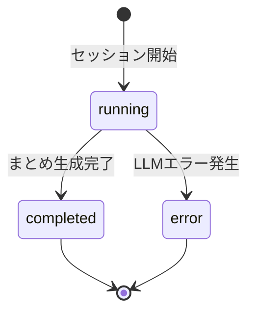

# プロジェクト用語集 (Glossary)

## 概要

このドキュメントは「AI討論 / AI Debate」プロジェクトで使用される用語の定義を管理します。

**更新日**: 2026-02-24

---

## ドメイン用語

### ペルソナ

**定義**: ユーザーがAIに割り当てる「役割・人格」。名前と立場・性格の説明で構成される。

**説明**: 議論を行うAIエージェントに個性を与えるための設定。2つのペルソナが対立する立場に設定されることで、多角的な議論が生まれる。

**関連用語**: [議論セッション](#議論セッション)、[AgentRunner](#agentrunner)

**使用例**:
- 「楽観的なコンサルタント」vs「慎重なリスクアナリスト」
- 「推進派のエンジニア」vs「コスト重視のCFO」

**英語表記**: Persona

**データモデル**: `src/app/models/debate.py` の `Persona` クラス

---

### 議論セッション

**定義**: ペルソナ設定からまとめ出力までの1回の議論の単位。

**説明**: ユーザーが設定を入力して「議論スタート」を押すと1つのセッションが生成される。セッションIDで管理され、SSEでリアルタイムに進行が配信される。

**関連用語**: [ペルソナ](#ペルソナ)、[議論ターン](#議論ターン)、[SSEイベント](#sseイベント)

**使用例**:
- 「セッションを開始する」: POSTリクエストでsession_idを発行する
- 「セッションに接続する」: GETリクエストでSSEストリームを受信する

**英語表記**: Debate Session

**データモデル**: `src/app/models/debate.py` の `DebateSession` クラス

---

### 議論ターン

**定義**: 1ペルソナが発言する1回分の単位。ツール使用と発言テキストを含む。

**説明**: ペルソナAが発言 → ペルソナBが発言 = 1ラウンド（往復）。デフォルト2ターン（A・B各2発言、計4ターン）。UIで1〜6ターンを選択可能。

**関連用語**: [ツール呼び出し](#ツール呼び出し)、[議論セッション](#議論セッション)

**英語表記**: Debate Turn

**データモデル**: `src/app/models/debate.py` の `DebateTurn` クラス

---

### ツール呼び出し

**定義**: AIエージェントが発言中に自律的に外部機能（Web検索等）を実行すること。

**説明**: ClaudeのSDKにおける `tool_use` 機能を使用。AIが「情報が必要」と判断した場合に自律的にツールを選択・実行し、結果を発言に組み込む。ユーザー画面にはツール使用中であることがリアルタイム表示される。

**関連用語**: [tool_useループ](#tool_useループ)、[Web検索ツール](#web検索ツール)

**英語表記**: Tool Call

**データモデル**: `src/app/models/debate.py` の `ToolCall` クラス

---

### 議論まとめ

**定義**: 全ターン終了後にAIが自動生成する、双方の主張と結論を整理した出力。

**説明**: ペルソナAの主要な主張・ペルソナBの主要な主張・総合的な結論の3パートで構成される。議論の全ログを参照して専用のLLM呼び出しで生成する。

**英語表記**: Debate Summary

---

### デモ

**定義**: ポートフォリオとしてクライアントにアプリを実演すること。

**説明**: 本プロジェクトの主要なユースケース。非エンジニアのクライアントの前で、その場でペルソナとテーマを設定してAIが議論する様子を見せる。センシティブな資料を用意する必要がなく、直感的に「AIが動いている」様子を体験できることが価値。

---

## 技術用語

### FastAPI

**定義**: PythonのモダンなWebフレームワーク。非同期処理とPydanticによる型バリデーションが特徴。

**本プロジェクトでの用途**:
- REST APIエンドポイントの提供（`/api/debate/start`）
- SSEストリームの配信（`/api/debate/{id}/stream`）
- フロントエンド静的ファイルの配信

**バージョン**: >=0.115.0

**関連ドキュメント**: [アーキテクチャ設計書](./architecture.md)

---

### AWS Bedrock

**定義**: AWSが提供するマネージドAIサービス。複数のLLMをAPIとして利用できる。

**本プロジェクトでの用途**: Claude（claude-haiku-4-5）の呼び出しに使用。IAMロールまたは環境変数で認証するため、Anthropic APIキーは不要。

**バージョン**: 利用するモデル: `claude-haiku-4-5`

**BedrockモデルID（実装）**: `us.anthropic.claude-haiku-4-5-20251001-v1:0`（クロスリージョン推論プロファイル）

**選定理由**: App RunnerのIAMロールで認証でき、アクセスキー管理が不要。エンタープライズ向けAI連携としてポートフォリオアピールにもなる。

**関連ドキュメント**: [アーキテクチャ設計書](./architecture.md#bedrock利用要件)

---

### Anthropic SDK（AnthropicBedrock）

**定義**: AnthropicのPython SDK。AWS Bedrock経由でClaudeを呼び出す `AnthropicBedrock` クライアントを提供する。

**本プロジェクトでの用途**: `AgentRunner` 内でClaudeのtool_use APIを直接呼び出すために使用。LangChain等のフレームワークは使用しない。

**バージョン**: >=0.40.0

**設定例**:
```python
from anthropic import AsyncAnthropicBedrock

# IAMロールまたは環境変数（AWS_ACCESS_KEY_ID等）を自動検出
client = AsyncAnthropicBedrock(
    aws_region=os.environ.get("AWS_REGION", "us-east-1"),
)
```

---

### Tavily

**定義**: LLM向けに設計されたWeb検索API。検索結果をLLMが読みやすい形式で返す。

**本プロジェクトでの用途**: `WebSearchTool` の実装に使用。エージェントがWeb検索ツールを呼び出したときに実行される。

**バージョン**: tavily-python >=0.3.0

**選定理由**: LLM向けAPIとして設計されており、検索結果がテキスト形式で取得しやすい。無料枠（月1,000リクエスト）でデモ用途に十分。

---

### SSE（Server-Sent Events）

**正式名称**: Server-Sent Events

**定義**: サーバーからクライアントへの単方向リアルタイムデータ配信の仕組み。HTTPの標準技術。

**本プロジェクトでの用途**: 議論の進行（発言・ツール使用・まとめ）をリアルタイムでブラウザに配信する。`sse-starlette` ライブラリで実装。

**WebSocketとの違い**: WebSocketは双方向通信。SSEは単方向（サーバー→クライアント）のみだが、本アプリは議論中にサーバーが送るだけなのでSSEで十分。

**実装箇所**: `src/app/routers/debate.py`

---

## 略語

### LLM

**正式名称**: Large Language Model

**意味**: 大規模言語モデル。大量のテキストデータで学習した自然言語処理AI。

**本プロジェクトでの使用**: ClaudeがLLM。AWS Bedrockを経由して呼び出す。

---

### MVP

**正式名称**: Minimum Viable Product

**意味**: 最小限の機能を持つ実用的なプロダクト。

**本プロジェクトでの使用**: フェーズ1として1〜2週間で開発する範囲。ペルソナ設定・議論実行・Web検索・まとめ出力のみを含む。

---

### API

**正式名称**: Application Programming Interface

**意味**: ソフトウェア間の通信インターフェース。

**本プロジェクトでの使用**: FastAPIが提供するRESTful API、AWS BedrockのAPI、TavilyのAPIを指す。

---

## アーキテクチャ用語

### DebateService

**定義**: 議論セッションのライフサイクルを管理するサービスクラス。

**本プロジェクトでの適用**: APIレイヤー（Router）がインフラ層（session_store）に直接依存しないよう仲介する。セッション作成・バックグラウンド議論開始・SSEキュー取得・エクスポート用セッション取得・キュー解放を一元管理する。コンストラクタで `DebateOrchestrator` を受け取るDIパターンを採用しており、テスト時にモックへ差し替え可能。`routers/debate.py` ではモジュールロード時に `_debate_service = DebateService()` としてシングルトン相当のインスタンスを生成して使用する。

**関連コンポーネント**: `DebateOrchestrator`, `session_store`

**実装箇所**: `src/app/services/debate_service.py`

---

### DebateOrchestrator

**定義**: 議論セッション全体の進行を制御するサービスクラス。

**本プロジェクトでの適用**: ペルソナAとBの発言順序管理・`AgentRunner`の呼び出し・まとめ生成・SSEキューへのイベント送信を担当する。

**関連コンポーネント**: `AgentRunner`, `asyncio.Queue`, `AsyncAnthropicBedrock`（DI可能・`AgentRunner` と共有）

**実装箇所**: `src/app/services/debate_orchestrator.py`

---

### AgentRunner

**定義**: 1ペルソナの1ターン発言を生成するサービスクラス。

**本プロジェクトでの適用**: tool_useループを実行し、Claudeが必要に応じてツールを使いながら発言テキストを生成する。発言中のトークンとツール使用イベントをSSEキューに送信する。

**関連コンポーネント**: `DebateOrchestrator`, `WebSearchTool`, AWS Bedrock

**実装箇所**: `src/app/services/agent_runner.py`

---

### WebSearchTool

**定義**: Web検索機能を提供するインフラクラス。Tavily APIのラッパー。

**本プロジェクトでの適用**: `AgentRunner` から呼び出され、検索クエリを受け取って検索結果テキストを返す。検索失敗時は `SearchError` を送出する（議論は継続可能）。

**実装箇所**: `src/app/infra/web_search.py`

---

### tool_useループ

**定義**: Claude SDKのtool_use機能を使ったエージェントの実行サイクル。

**説明**: Claudeがツールを使いたい場合 `stop_reason="tool_use"` を返す。アプリ側でツールを実行して結果を返すと、Claudeが次の応答を生成する。このサイクルをClaudeが通常テキスト（`stop_reason="end_turn"`）を返すまで繰り返す。

**図解**:
```
[アプリ] → messages送信 → [Claude]
[Claude] → tool_use要求 → [アプリ]
[アプリ] → ツール実行 → [外部API]
[外部API] → 結果 → [アプリ]
[アプリ] → tool_result送信 → [Claude]
[Claude] → end_turn（通常テキスト）→ [アプリ]
```

**実装箇所**: `src/app/services/agent_runner.py`

---

### インメモリセッション

**定義**: データベースを使わず、Pythonの `dict` でサーバーメモリ上にセッションを保持する方式。

**本プロジェクトでの適用**: MVPではDB不要のシンプルな実装として採用。サーバー再起動でセッションは消えるが、デモ用途のため許容する。

**制約**: 同時接続数が増えるとメモリを消費する。Post-MVPでRedis/SQLiteに移行予定。

---

## ステータス・状態

### 議論セッションのステータス

**定義**: `DebateSession` が取りうる状態。

| ステータス | 意味 | 遷移条件 |
|----------|------|---------|
| `running` | 議論実行中 | セッション開始直後 |
| `completed` | 議論完了 | まとめ生成が完了したとき |
| `error` | エラー終了 | LLMエラー等で議論が中断したとき |

**状態遷移図**:


---

### SSEイベントタイプ

**定義**: フロントエンドへ配信されるSSEイベントの種類。

| イベントタイプ | 意味 | ペイロード例 |
|--------------|------|-------------|
| `turn_start` | ペルソナの発言開始 | `{"type": "turn_start", "speaker": "persona_a", "name": "楽観コンサル"}` |
| `token` | 発言テキストのストリーム | `{"type": "token", "speaker": "persona_a", "text": "AIへの投資は"}` |
| `tool_start` | ツール使用開始 | `{"type": "tool_start", "speaker": "persona_a", "tool": "web_search", "query": "AI投資 ROI"}` |
| `tool_end` | ツール使用完了 | `{"type": "tool_end", "speaker": "persona_a", "tool": "web_search", "result_summary": "検索結果を取得しました"}` |
| `turn_end` | 発言完了 | `{"type": "turn_end", "speaker": "persona_a", "content": "AIへの投資は..."}` |
| `summary_start` | まとめ生成開始 | `{"type": "summary_start"}` |
| `summary_token` | まとめテキストのストリーム | `{"type": "summary_token", "text": "・ペルソナAの主張:"}` |
| `complete` | 全議論完了 | `{"type": "complete", "session_id": "abc123"}` |
| `error` | エラー発生 | `{"type": "error", "message": "AI応答の取得に失敗しました"}` |

---

## エラー・例外

### DebateError

**クラス名**: `DebateError`

**継承元**: `Exception`

**発生条件**: 議論アプリ全体の基底例外。直接は使用せず、サブクラスを使用する。

**実装箇所**: `src/app/models/errors.py`

---

### ValidationError

**クラス名**: `ValidationError`

**継承元**: `DebateError`

**発生条件**: ユーザー入力が不正な場合（空文字・文字数超過等）。

**対処方法**:
- ユーザー: 入力内容を修正する
- 開発者: Pydanticスキーマのバリデーションルールを確認する

**ログレベル**: WARN（ユーザー起因のため）

**使用例**:
```python
# Pydanticが自動で発生させる
class PersonaInput(BaseModel):
    name: str = Field(min_length=1, max_length=50)
```

---

### LLMError

**クラス名**: `LLMError`

**継承元**: `DebateError`

**発生条件**: AWS Bedrock / Claude APIへの呼び出しが失敗した場合。

**対処方法**:
- ユーザー: 「しばらく後に再試行してください」と表示される
- 開発者: AWSの認証情報・リージョン設定・Bedrockのモデルアクセス権限を確認する

**ログレベル**: ERROR（システム起因のため）

**議論への影響**: **議論を中断する**（`SearchError` と異なる点）

---

### SearchError

**クラス名**: `SearchError`

**継承元**: `DebateError`

**発生条件**: Tavily APIへのWeb検索呼び出しが失敗した場合。

**対処方法**:
- ユーザー: ツールログに「検索失敗」と表示されるが議論は継続される
- 開発者: Tavily APIキーの有効性・リクエスト制限を確認する

**ログレベル**: WARN

**議論への影響**: **議論は継続する**（`LLMError` と異なる点）。検索失敗の旨をツール結果としてClaudeに返し、検索なしで発言を続けさせる。

---

### SessionNotFoundError

**クラス名**: `SessionNotFoundError`

**継承元**: `DebateError`

**発生条件**: 存在しない `session_id` でSSEストリームに接続しようとした場合。

**対処方法**:
- ユーザー: 「議論セッションが見つかりません。最初からやり直してください」と表示される
- 開発者: サーバーが再起動してインメモリセッションが消えた可能性がある

**HTTPステータス**: 404 Not Found

---

## 索引

### あ行
- [インメモリセッション](#インメモリセッション) - アーキテクチャ用語

### か行
- [議論セッション](#議論セッション) - ドメイン用語
- [議論ターン](#議論ターン) - ドメイン用語
- [議論まとめ](#議論まとめ) - ドメイン用語

### さ行
- [SessionNotFoundError](#sessionnotfounderror) - エラー・例外
- [SearchError](#searcherror) - エラー・例外

### た行
- [ツール呼び出し](#ツール呼び出し) - ドメイン用語
- [デモ](#デモ) - ドメイン用語

### な行

### は行
- [ペルソナ](#ペルソナ) - ドメイン用語

### ま行
- [MVP](#mvp) - 略語

### A-Z
- [AgentRunner](#agentrunner) - アーキテクチャ用語
- [API](#api) - 略語
- [Anthropic SDK](#anthropic-sdkanthropicbedrock) - 技術用語
- [AWS Bedrock](#aws-bedrock) - 技術用語
- [DebateError](#debateerror) - エラー・例外
- [DebateOrchestrator](#debateorchestrator) - アーキテクチャ用語
- [FastAPI](#fastapi) - 技術用語
- [LLM](#llm) - 略語
- [LLMError](#llmerror) - エラー・例外
- [SSE](#sseserver-sent-events) - 略語
- [SSEイベントタイプ](#sseイベントタイプ) - ステータス・状態
- [Tavily](#tavily) - 技術用語
- [tool_useループ](#tool_useループ) - アーキテクチャ用語
- [ValidationError](#validationerror) - エラー・例外
- [WebSearchTool](#websearchtool) - アーキテクチャ用語
